

# Android Sideloader

### Super-simple, portable, non-technical sideloading for everyone

Android Sideloader is a portable app that lets you very easily sideload apps onto your Android device.
Just:
1. Open Android Sideloader
2. Select your device
3. Choose an APK file (or drag and drop one)
4. Click `Install APK`

That's it! The entire process only takes a few seconds. **No command lines, no installing SDKs, no installing ADB, no
installing drivers** - Just download and run!

#### See it in action:

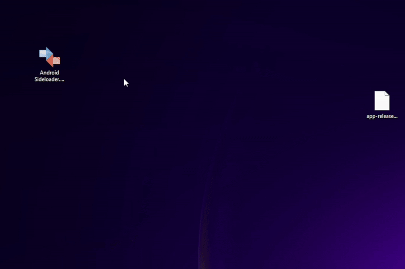

## Downloading

1. Go to the [Latest Release](https://github.com/ryan-andrew/android_sideloader/releases/latest)
2. Click on the `Assets` dropdown
3. Choose your download
   - `AndroidSideloader-v*.*.*-Windows-Installer.exe`
     - This will installer Android Sideloader on your PC. For those who prefer having it installed in a normal way.
   - `AndroidSideloader-v*.*.*-Windows-Portable.zip`
     - This is a portable package of Android Sideloader. Unzip this wherever you want and run `android_sideloader.exe`
       from inside the new folder.
   - `AndroidSideloader-v*.*.*.exe`
     - This is an all-in-one package. It's a single exe file that can be run anywhere. This can sometimes be flagged
       as a virus due to the way it works. See notice below for more details. If you have issues with this, choose one
       of the other downloads. Choose the `AndroidSideloader-v*.*.*-Windows-Portable.zip` if you need it to be
       portable, or `AndroidSideloader-v*.*.*-Windows-Installer.exe` otherwise.

### Notice on virus detection

This project is completely open source. The releases are generated automatically from source on GitHub itself. The
build file is here: [.github/workflows/release.yml](.github/workflows/release.yml)

Android Sideloader is portable by default. `AndroidSideloader-v*.*.*-Windows-Portable.zip` represents the pure build
in a zip file. This will never trigger virus detectors, because there are no viruses in it.
[VirusTotal link](https://www.virustotal.com/gui/file/c2cde232ef3e3280e20a0fd8be37cf03b2ad45c291f646f70880c5d837ccedc1/detection).

The installer (`AndroidSideloader-v*.*.*-Windows-Installer.exe`) is created via [Inno Setup](https://en.wikipedia.org/wiki/Inno_Setup)
([GitHub Link](https://github.com/jrsoftware/issrc)), which is a trusted and widely used software for creating
installers. The source file for generating our installer is at [installer.iss](installer.iss). A couple of really lazy
antivirus software providers may mark these as viruses, but they are not.
[VirusTotal link](https://www.virustotal.com/gui/file/284bf312f62808c53f125421ab32a65c2aec1ccc1f5e83e25d469470dfa18b2b/detection).

The all-in-one package (`AndroidSideloader-v*.*.*.exe`) is created via
[Enigma Virtual Box](https://enigmaprotector.com/en/aboutvb.html). This works by packaging Android Sideloader into a
container that virtualizes the files it needs to run. This way, it's a single exe file that can be run anywhere.
The script that is used to create this is in the repo at [package.evb](package.evb). This
method (having an exe that runs another exe hidden inside the first) is also sometimes used by malware, so antivirus
software more frequently marks this as a virus, but it is not. 
[VirusTotal link](https://www.virustotal.com/gui/file/662fca087c4deb02a90ab01e81ef320fbac654de50d77e4bac12670662321bc4/detection).
If you have issues using this, choose the `AndroidSideloader-v*.*.*-Windows-Portable.zip` if you need it to be
portable, or `AndroidSideloader-v*.*.*-Windows-Installer.exe` otherwise.

## First Time Setup

### Prerequisites

Ensure that USB debugging is turned on in your Android device settings
  - https://developer.android.com/studio/debug/dev-options#enable

### Steps

1. The first time you launch Android Sideloader, Windows may warn you that the app is not from a known developer. You
will need to click "More Info", then "Run Anyway".

    <figure>
      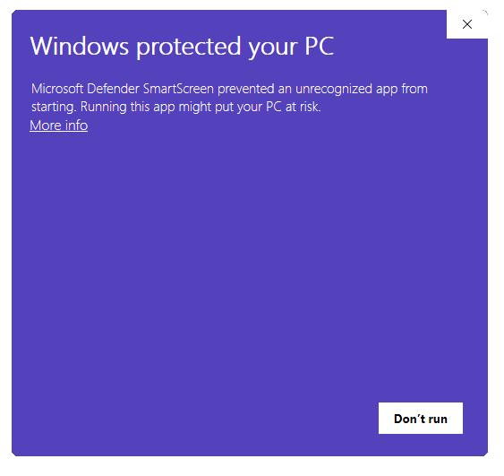
      <figcaption><em>Click "More Info"</em></figcaption>
    </figure>

    <figure>
      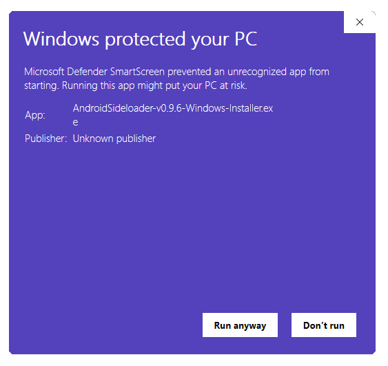
      <figcaption><em>Click "Run Anyway"</em></figcaption>
    </figure>

2. Additionally, ADB may request networking permissions from the Windows Firewall. This
is due to the way ADB works internally, setting up a local server. This app does not require or use the Internet.
3.  On your device, you may see a dialog the first time your run the app. Make sure you tap `Allow` when prompted.

    <figure>
      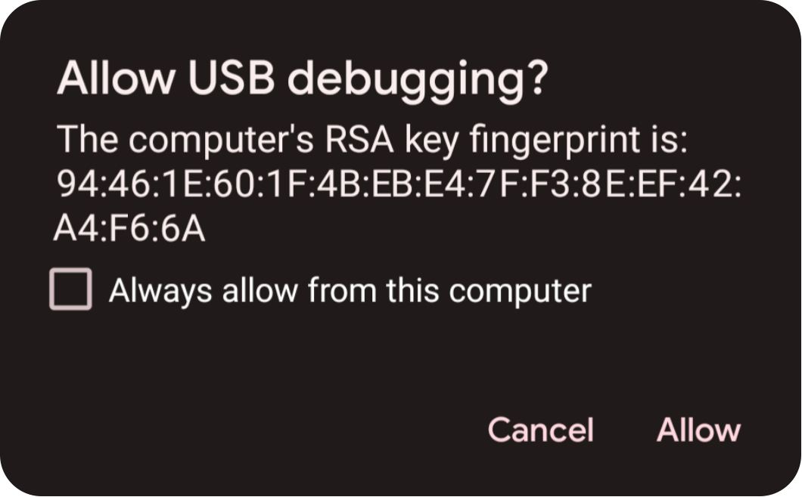
      <figcaption><em>Tapping "Always allow from this computer" will ensure that you only ever need to do this once</em></figcaption>
    </figure>

## How to Use

1. Open Android Sideloader

    <figure>
      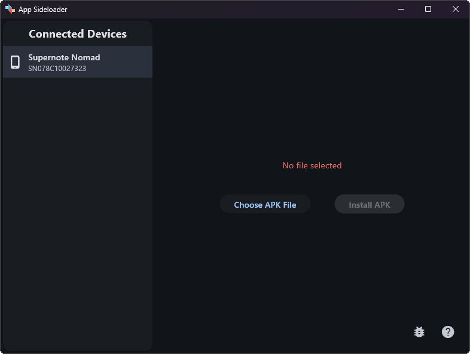
      <figcaption><em>The Android Sideloader screen</em></figcaption>
    </figure>

2. Select your device

    <figure>
      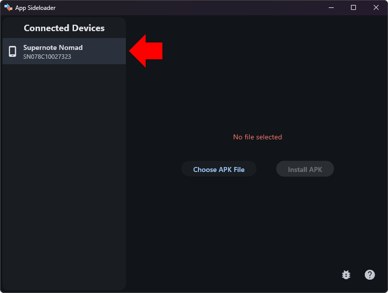
      <figcaption><em>Devices appear in "Connected Devices" list</em></figcaption>
    </figure>

3. Choose an APK file (or drag and drop one)

    <figure>
      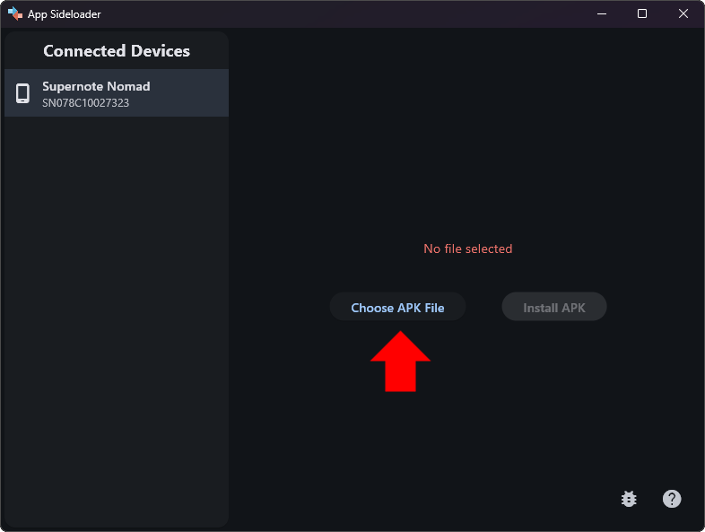
      <figcaption><em>A file browser window will appear where you can select the APK file you want to install</em></figcaption>
    </figure>

    <figure>
      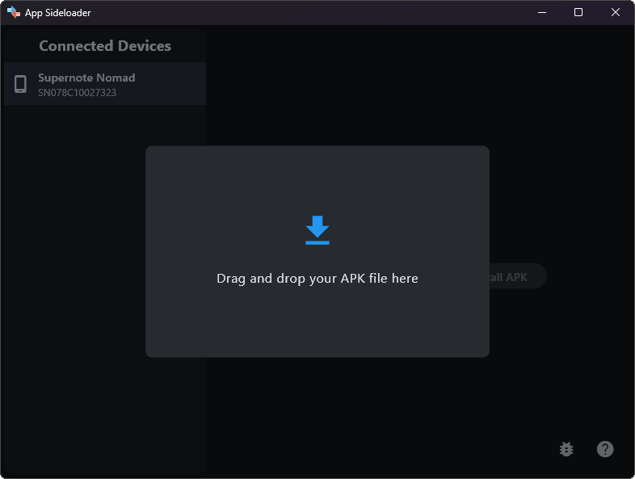
      <figcaption><em>You can also just drag and drop your APK file into the Android Sideloader window</em></figcaption>
    </figure>

4. Click `Install APK`

    <figure>
      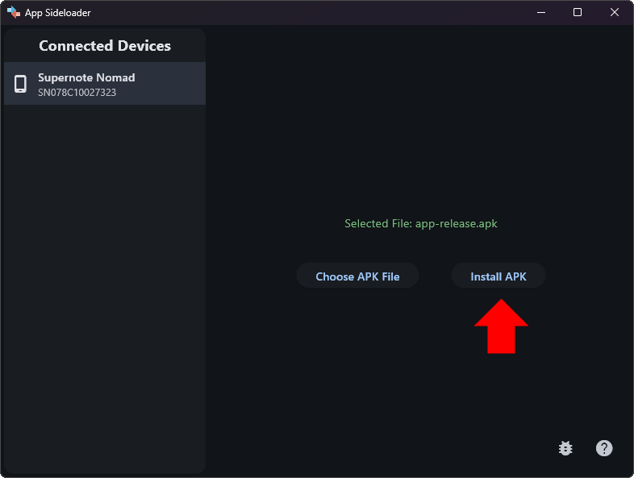
      <figcaption><em></em></figcaption>
    </figure>

5. The app is installed

    <figure>
      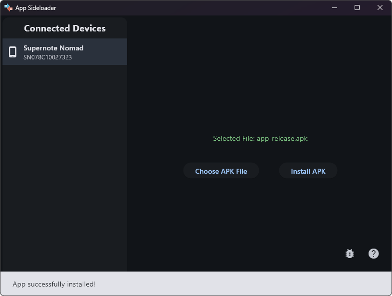
      <figcaption><em></em></figcaption>
    </figure>
   
### Video Demonstration

## Troubleshooting

### My device does not appear in the `Connected Devices` list!

- Ensure that USB debugging is turned on in your Android device settings
    - https://developer.android.com/studio/debug/dev-options#enable 
- Make sure you tap `Allow` when prompted on your Android device when you connect your device
    <figure>
      
      <figcaption><em>Tapping "Always allow from this computer" will ensure that you only ever need to do this once</em></figcaption>
    </figure>
- Try a different USB cable - not all of them will work
- Try a different USB port on your computer

### Something else

If you have any other problems, please [create an issue](https://github.com/ryan-andrew/android_sideloader/issues/new).
Please also attach the logs to the issue. Logs can be saved via the first button on the bottom right of the app:

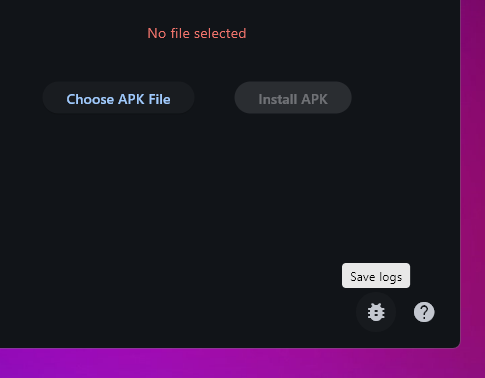
